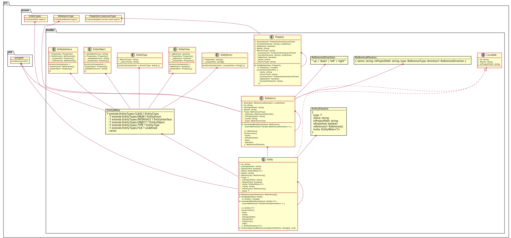
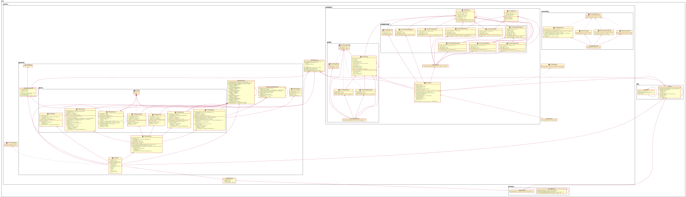

# msh-vision

<!-- toc -->

- [TODO](#todo)
  * [Diagram](#diagram)
    + [only model](#only-model)
    + [with no model](#with-no-model)

<!-- tocstop -->

# TODO

* Add formatting (new row) to class with long names

## Diagram

### only model

### with no model

